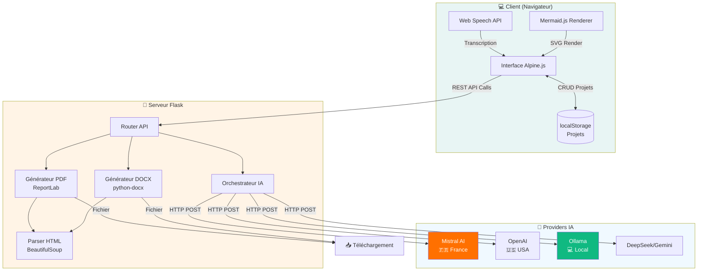
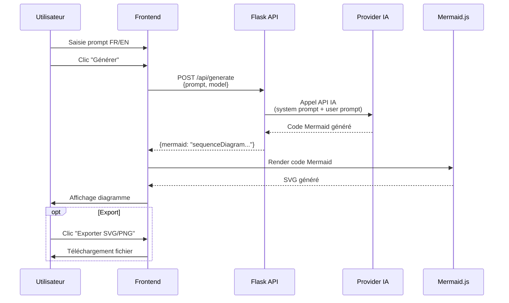
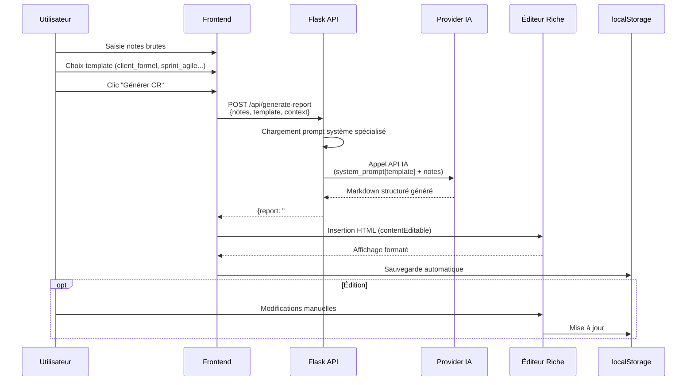
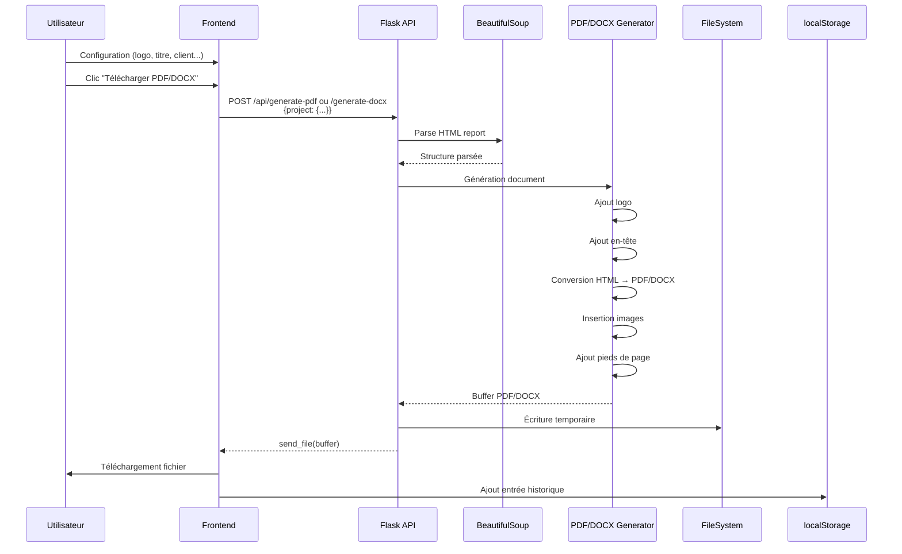

# 🏗️ Architecture SmartReport

## Table des Matières

- [Vue d'Ensemble](#vue-densemble)
- [Stack Technique Complète](#stack-technique-complète)
- [Architecture Globale](#architecture-globale)
- [Flux de Données](#flux-de-données)
- [Structure du Projet](#structure-du-projet)
- [Composants Clés](#composants-clés)
- [Modèle de Données](#modèle-de-données)
- [Génération PDF](#génération-pdf-reportlab)
- [Génération DOCX](#génération-docx-python-docx)

---

## Vue d'Ensemble

SmartReport est une **application web monopage (SPA)** qui combine :
- **Backend** : Serveur Flask REST API (Python)
- **Frontend** : Interface Alpine.js réactive
- **AI** : Intégration multi-providers (Mistral, OpenAI, DeepSeek, Gemini, Ollama)
- **Export** : Moteurs PDF (ReportLab) et DOCX (python-docx)

### Architecture en Couches

```
┌─────────────────────────────────────┐
│   Frontend (Alpine.js SPA)          │
│   - Interface utilisateur            │
│   - Gestion d'état (localStorage)    │
│   - Rendu diagrammes (Mermaid.js)   │
└─────────────┬───────────────────────┘
              │ REST API
┌─────────────▼───────────────────────┐
│   Backend (Flask 3)                  │
│   - Routage API                      │
│   - Orchestration IA                 │
│   - Génération PDF/DOCX              │
└─────────────┬───────────────────────┘
              │ HTTP
┌─────────────▼───────────────────────┐
│   Providers IA                       │
│   - Mistral AI (France, RGPD)        │
│   - OpenAI (USA)                     │
│   - Ollama (Local)                   │
│   - DeepSeek, Gemini                 │
└──────────────────────────────────────┘
```

---

## Stack Technique Complète

### Backend (Python 3.8+)

| Librairie | Version | Rôle |
|-----------|---------|------|
| **Flask** | 3.0.3 | Framework web, routing API REST |
| **ReportLab** | 4.4.3+ | Génération PDF professionnelle (tables, images, styles) |
| **python-docx** | 1.1.0+ | Export Microsoft Word éditable |
| **BeautifulSoup4** | 4.12.0+ | Parsing HTML pour conversion PDF/DOCX |
| **lxml** | 6.0.0+ | Processing XML rapide (BS4 backend) |
| **markdown** | 3.5.2 | Conversion Markdown → HTML |
| **svglib** | 1.6.0+ | Support SVG dans les PDFs |
| **requests** | 2.32.3 | Appels HTTP vers providers IA |
| **waitress** | 3.0.0 | Serveur WSGI production (Windows-friendly) |
| **python-dotenv** | 1.0.1 | Chargement variables d'environnement |

### Frontend (SPA)

| Technologie | Version | Rôle |
|-------------|---------|------|
| **Alpine.js** | 3.x | Framework réactif léger (~15KB, alternative à Vue/React) |
| **Tailwind CSS** | 3.x | Framework CSS utility-first |
| **Mermaid.js** | 10.x | Rendu diagrammes vectoriels (flowchart, sequence, etc.) |
| **Web Speech API** | Native | Dictée vocale navigateur (Chrome/Edge) |

---

## Architecture Globale

### Diagramme d'Architecture Complet



---

## Flux de Données

### 1️⃣ Génération de Diagramme



### 2️⃣ Génération de Compte Rendu



### 3️⃣ Export PDF/DOCX



---

## Structure du Projet

```
SmartReport/
│
├── 📄 app.py (2569 lignes)          # Backend Flask principal
│   ├── Configuration (providers IA, .env)
│   ├── Routes API REST (8 endpoints)
│   ├── Prompts système (5 templates)
│   ├── Fonctions de génération IA
│   ├── Moteur PDF (ReportLab)
│   └── Moteur DOCX (python-docx)
│
├── 📁 templates/                     # Templates HTML
│   ├── index.html (2899 lignes)     # SPA principale (Alpine.js)
│   ├── mentions-legales.html        # Page mentions légales
│   ├── confidentialite.html         # Politique de confidentialité
│   └── conditions.html              # Conditions générales
│
├── 📁 static/                        # Ressources statiques
│   ├── enovacom_logo.png            # Logo Enovacom (par défaut)
│   └── favicon.svg                  # Icône de l'application
│
├── 📁 docs/                          # Documentation (cette section)
│   ├── ARCHITECTURE.md              # Ce fichier
│   ├── API.md                       # Documentation API REST
│   ├── INSTALLATION.md              # Guide d'installation
│   ├── USAGE.md                     # Guide d'utilisation
│   └── CONTRIBUTING.md              # Guide de contribution
│
├── 📄 requirements.txt               # Dépendances Python
├── 📄 start.bat                      # Script de démarrage Windows
├── 📄 .env.example                   # Template configuration
├── 📄 .gitignore                     # Fichiers ignorés Git
└── 📄 README.md                      # Documentation principale
```

---

## Composants Clés

### 1. Backend Flask (`app.py`)

#### Routes API REST

| Endpoint | Méthode | Description |
|----------|---------|-------------|
| `/` | GET | Affiche l'interface principale |
| `/api/generate` | POST | Génère code Mermaid depuis prompt |
| `/api/generate-report` | POST | Génère compte rendu structuré |
| `/api/generate-pdf` | POST | Export PDF professionnel |
| `/api/generate-docx` | POST | Export DOCX éditable |
| `/api/ai/models` | GET | Liste modèles disponibles |
| `/api/ai/settings` | POST | Sauvegarde config provider |
| `/api/ai/test` | POST | Test connexion provider |

#### Prompts Système (5 Templates)

Chaque template dispose d'un prompt système optimisé :

1. **`client_formel`** : Compte rendu de réunion client professionnel
2. **`sprint_agile`** : Synthèse de sprint (daily, review, retrospective)
3. **`brief_technique`** : Atelier technique (architecture, choix techno)
4. **`crm_echange`** : CR commercial avec opportunités détectées
5. **`correction_orthographe`** : Correction grammaticale sans modification de contenu

### 2. Frontend Alpine.js (`templates/index.html`)

#### État Applicatif Principal

```javascript
{
  // Gestion diagrammes
  prompt: '',
  mermaidCode: '',
  models: [],
  selectedModel: '',
  
  // Projet actuel
  currentProject: {
    id: null,
    name: '',
    diagram: { mermaid: '', svg: '', include: true, position: 'before_report', title: '' },
    report: { template: '', rawNotes: '', generated: '', meta: {} },
    images: [],
    pdfConfig: { logo: '', title: '', client: '', subtitle: '', footer: '', legal: '', watermark: false, theme: {...}, order: [] }
  },
  
  // Historique
  projects: [],  // Sauvegardé dans localStorage
  
  // UI States
  loading: false,
  isGeneratingReport: false,
  isGeneratingPDF: false,
  showSettings: false,
  
  // Thèmes visuels
  availableThemes: [...],  // 30+ thèmes Mermaid
  primaryColor: '#0C4A45',
  fontFamily: 'Poppins, sans-serif'
}
```

#### Fonctions Clés

```javascript
// Génération
generateDiagram()        // Appel /api/generate
generateReport()         // Appel /api/generate-report
generatePDF()            // Appel /api/generate-pdf
generateDOCX()           // Appel /api/generate-docx

// Gestion projets
saveProject()            // Sauvegarde dans localStorage
loadProject(id)          // Charge un projet existant
deleteProject(id)        // Supprime un projet
addExportToHistory(fmt)  // Ajoute entrée historique avec nouvel ID

// Images
addImages(files)         // Upload images
removeImage(index)       // Suppression
updateImageTitle(i, t)   // Mise à jour titre

// Diagrammes
exportSVG()              // Export SVG
exportPNG()              // Export PNG
exportJPEG()             // Export JPEG
updateMermaidTheme()     // Applique thème personnalisé
```

---

## Modèle de Données

### Structure d'un Projet (localStorage)

```typescript
interface Project {
  id: number;                    // Timestamp de création (unique)
  name: string;                  // Nom du projet (auto-généré ou custom)
  createdAt: string;             // ISO 8601 datetime
  updatedAt: string;             // ISO 8601 datetime
  
  diagram: {
    mermaid: string;             // Code Mermaid brut
    svg: string;                 // SVG rendu (base64 ou text)
    include: boolean;            // Inclure dans export PDF?
    position: 'before_report' | 'after_report';  // Position relative
    title: string;               // Titre du diagramme
  };
  
  report: {
    template: 'client_formel' | 'sprint_agile' | 'brief_technique' | 'crm_echange' | 'correction_orthographe';
    rawNotes: string;            // Notes brutes saisies
    generated: string;           // HTML généré (contentEditable)
    meta: {
      date: string;              // Date réunion (JJ/MM/AAAA)
      participants: string;      // Liste participants
    };
  };
  
  images: Array<{
    id: number;                  // Timestamp unique
    title: string;               // Titre affiché dans PDF
    dataUrl: string;             // Base64 data URL (data:image/png;base64,...)
  }>;
  
  pdfConfig: {
    logo: string;                // Base64 data URL logo
    title: string;               // Titre document
    client: string;              // Nom client
    subtitle: string;            // Sous-titre
    footer: string;              // Template pied de page ({page}/{pages}, {projet}, {date})
    legal: string;               // Mentions légales
    watermark: boolean;          // Afficher "CONFIDENTIEL"?
    page_numbers: boolean;       // Numérotation pages?
    theme: {
      font: string;              // Famille de police
      primary: string;           // Couleur primaire (hex #RRGGBB)
      margins: {
        top: number;             // Marges en mm
        right: number;
        bottom: number;
        left: number;
      };
    };
    order: Array<'report' | 'images' | 'diagram'>;  // Ordre des sections
  };
}
```

### Stockage localStorage

```javascript
// Clé : 'smartreport_projects'
// Valeur : JSON.stringify(projects[])

// Sauvegarde
localStorage.setItem('smartreport_projects', JSON.stringify(this.projects));

// Chargement
const projects = JSON.parse(localStorage.getItem('smartreport_projects') || '[]');

// Limite : 20 projets max (suppression automatique des plus anciens)
if (projects.length > 20) {
  projects = projects.slice(0, 20);
}
```

---

## Génération PDF (ReportLab)

### Pipeline de Génération

```python
from reportlab.platypus import SimpleDocTemplate, Paragraph, Spacer, Image, Table, PageBreak, KeepTogether

def generate_pdf(project):
    # 1. Créer document PDF
    pdf_buffer = io.BytesIO()
    doc = SimpleDocTemplate(
        pdf_buffer,
        pagesize=A4,
        rightMargin=18*mm,
        leftMargin=18*mm,
        topMargin=24*mm,
        bottomMargin=28*mm
    )
    
    # 2. Créer story (liste d'éléments)
    story = []
    
    # 3. Ajouter logo
    if pdf_config['logo']:
        logo_img = Image(logo_buffer, width=available_width, height=60*mm)
        story.append(logo_img)
        story.append(Spacer(1, 12*mm))
    
    # 4. Ajouter en-tête
    title_style = ParagraphStyle(
        'Title',
        parent=styles['Heading1'],
        fontSize=24,
        textColor=colors.HexColor(primary_color),
        spaceAfter=6*mm
    )
    story.append(Paragraph(pdf_config['title'], title_style))
    
    if pdf_config['client']:
        story.append(Paragraph(f"Client : {pdf_config['client']}", client_style))
    
    # 5. Parser HTML → ReportLab elements
    soup = BeautifulSoup(report_html, 'html.parser')
    for element in soup.children:
        if element.name == 'h2':
            story.append(Paragraph(text, h2_style))
        elif element.name == 'p':
            story.append(Paragraph(text, normal_style))
        elif element.name == 'ul':
            for li in element.find_all('li'):
                story.append(Paragraph(f"• {li_text}", bullet_style))
        elif element.name == 'table':
            table_data = parse_html_table(element)
            tbl = Table(table_data, colWidths=[...])
            tbl.setStyle(table_style)
            story.append(tbl)
    
    # 6. Ajouter images
    for img in images:
        title_para = Paragraph(f"<b>{img['title']}</b>", image_title_style)
        img_rl = Image(img_buffer, width=w, height=h)
        story.append(KeepTogether([title_para, Spacer(1, 2*mm), img_rl]))
    
    # 7. Construire PDF avec pieds de page
    def add_page_footer(canvas, doc):
        canvas.saveState()
        # Mentions légales
        canvas.setFont('Helvetica', 8)
        canvas.drawString(left_margin, 10*mm, pdf_config['legal'])
        # Numérotation
        page_text = pdf_config['footer'].format(
            page=doc.page,
            pages='?',  # Calculé après construction
            projet=pdf_config['title'],
            date=date.today().strftime('%d/%m/%Y')
        )
        canvas.drawRightString(right_margin, 10*mm, page_text)
        canvas.restoreState()
    
    doc.build(story, onFirstPage=add_page_footer, onLaterPages=add_page_footer)
    
    return pdf_buffer.getvalue()
```

### Gestion des Tableaux HTML → ReportLab

```python
def parse_html_table(table_element):
    rows = []
    for tr in table_element.find_all('tr'):
        cells = []
        for cell in tr.find_all(['th', 'td']):
            cells.append(cell.get_text())
        rows.append(cells)
    
    # Créer Table ReportLab
    tbl = Table(rows, colWidths=[col1_width, col2_width, ...])
    
    # Appliquer style professionnel
    tbl.setStyle(TableStyle([
        # Grille
        ('GRID', (0,0), (-1,-1), 0.75, colors.HexColor(primary_color)),
        
        # En-tête (première ligne)
        ('BACKGROUND', (0,0), (-1,0), colors.HexColor('#0f5650')),  # Vert Enovacom foncé
        ('TEXTCOLOR', (0,0), (-1,0), colors.white),
        ('FONTNAME', (0,0), (-1,0), 'Helvetica-Bold'),
        ('FONTSIZE', (0,0), (-1,0), 10),
        
        # Corps du tableau
        ('FONTSIZE', (0,1), (-1,-1), 9),
        ('VALIGN', (0,0), (-1,-1), 'MIDDLE'),
        ('ALIGN', (0,0), (-1,-1), 'LEFT'),
        ('LEFTPADDING', (0,0), (-1,-1), 6),
        ('RIGHTPADDING', (0,0), (-1,-1), 6),
        ('TOPPADDING', (0,0), (-1,-1), 4),
        ('BOTTOMPADDING', (0,0), (-1,-1), 4),
    ]))
    
    return tbl
```

---

## Génération DOCX (python-docx)

### Pipeline de Génération

```python
from docx import Document
from docx.shared import RGBColor, Pt, Inches, Mm

def generate_docx(project):
    # 1. Créer document
    doc = Document()
    
    # 2. Configurer marges
    section = doc.sections[0]
    section.top_margin = Mm(24)
    section.bottom_margin = Mm(28)
    section.left_margin = Mm(18)
    section.right_margin = Mm(18)
    
    # 3. Ajouter logo
    if logo:
        doc.add_picture(logo_buffer, width=Inches(6))
        doc.add_paragraph()  # Espacement
    
    # 4. Ajouter titre
    heading = doc.add_heading(pdf_config['title'], level=1)
    heading.runs[0].font.color.rgb = RGBColor(12, 74, 69)  # #0C4A45
    heading.runs[0].font.size = Pt(24)
    
    # 5. Ajouter sous-titre / client
    if pdf_config['client']:
        para = doc.add_paragraph()
        run = para.add_run(f"Client : {pdf_config['client']}")
        run.font.size = Pt(12)
        run.font.italic = True
    
    # 6. Parser HTML → python-docx
    soup = BeautifulSoup(report_html, 'html.parser')
    for element in soup.children:
        if element.name == 'h2':
            doc.add_heading(text, level=2)
        elif element.name == 'p':
            para = doc.add_paragraph()
            # Parser rich text (gras, italique, liens)
            for child in element.children:
                if child.name == 'strong':
                    run = para.add_run(child.text)
                    run.font.bold = True
                elif child.name == 'em':
                    run = para.add_run(child.text)
                    run.font.italic = True
                else:
                    para.add_run(child if isinstance(child, str) else child.text)
        elif element.name == 'ul':
            for li in element.find_all('li'):
                doc.add_paragraph(li.text, style='List Bullet')
        elif element.name == 'table':
            table = parse_html_table_to_docx(element, doc)
    
    # 7. Ajouter images
    for img in images:
        doc.add_heading(img['title'], level=2)
        doc.add_picture(img_buffer, width=Inches(6))
    
    # 8. Sauvegarder
    docx_buffer = io.BytesIO()
    doc.save(docx_buffer)
    docx_buffer.seek(0)
    
    return docx_buffer.getvalue()
```

### Gestion des Tableaux HTML → python-docx

```python
def parse_html_table_to_docx(table_element, doc):
    rows_data = []
    for tr in table_element.find_all('tr'):
        cells = [cell.get_text() for cell in tr.find_all(['th', 'td'])]
        rows_data.append(cells)
    
    # Créer tableau
    table = doc.add_table(rows=len(rows_data), cols=len(rows_data[0]))
    table.style = 'Light Grid Accent 1'
    
    # Remplir cellules
    for i, row_data in enumerate(rows_data):
        for j, cell_text in enumerate(row_data):
            cell = table.rows[i].cells[j]
            cell.text = cell_text
            
            # En-tête (première ligne)
            if i == 0:
                for paragraph in cell.paragraphs:
                    for run in paragraph.runs:
                        run.font.bold = True
                        run.font.color.rgb = RGBColor(15, 86, 80)  # Vert Enovacom
    
    return table
```

---

## Points d'Extension

### Ajouter un Nouveau Provider IA

1. **Ajouter la configuration dans `.env.example`** :
   ```env
   NEW_PROVIDER_BASE_URL=https://api.newprovider.com
   NEW_PROVIDER_API_KEY=sk-xxxxx
   ```

2. **Charger la config dans `app.py`** :
   ```python
   config = {
       ...
       'new_provider_base_url': os.getenv('NEW_PROVIDER_BASE_URL', ''),
       'new_provider_api_key': os.getenv('NEW_PROVIDER_API_KEY', ''),
   }
   ```

3. **Ajouter la logique d'appel dans `generate()` et `generate_report()`** :
   ```python
   elif provider == 'new_provider':
       headers = {'Authorization': f'Bearer {api_key}'}
       response = requests.post(f"{base_url}/v1/chat/completions", headers=headers, json=payload)
   ```

4. **Ajouter l'option dans le frontend (`templates/index.html`)**.

### Ajouter un Nouveau Template de Compte Rendu

1. **Ajouter le prompt système dans `REPORT_PROMPTS` (`app.py`)** :
   ```python
   REPORT_PROMPTS = {
       ...
       'nouveau_template': """Tu es un [rôle].
       Tu rédiges des comptes rendus de [type].
       
       Structure OBLIGATOIRE :
       ## Section 1
       ...
       """
   }
   ```

2. **Ajouter l'option dans `reportTemplates` (`templates/index.html`)** :
   ```javascript
   reportTemplates: [
       ...
       { id: 'nouveau_template', name: 'Nouveau Template' }
   ]
   ```

---

## Performance

### Optimisations Backend

- **Waitress** : Serveur WSGI multi-thread pour Windows
- **Streaming** : `send_file()` pour éviter de charger tout le PDF en RAM
- **Cache** : Pas de cache volontaire (génération à la demande)

### Optimisations Frontend

- **Alpine.js** : ~15KB (vs React ~40KB + React DOM ~130KB)
- **localStorage** : Pas de requêtes serveur pour la sauvegarde des projets
- **Lazy loading** : Mermaid.js chargé seulement quand nécessaire

### Limites

| Limite | Valeur | Justification |
|--------|--------|---------------|
| Projets max | 20 | Éviter saturation localStorage (~5-10MB) |
| Taille image max | ~5MB | Base64 data URL limite pratique |
| Taille compte rendu | ~100KB HTML | Éviter timeouts génération IA |
| Timeout API IA | 60s | Provider-dependent |

---

## Sécurité

### Bonnes Pratiques Implémentées

✅ **Variables d'environnement** : Clés API stockées dans `.env` (gitignored)  
✅ **HTTPS recommandé** : Pour communications provider IA  
✅ **localStorage seulement** : Pas de base de données centralisée  
✅ **Pas de données sensibles côté serveur** : Projets stockés côté client  
✅ **Validation inputs** : Vérifications basiques sur les payloads API  

### Points d'Attention

⚠️ **localStorage non chiffré** : Accessible via DevTools  
⚠️ **Pas d'authentification** : Application interne, pas de login  
⚠️ **CORS permissif** : `Access-Control-Allow-Origin: *` (dev only)  
⚠️ **Clés API en clair dans .env** : Utiliser des variables d'environnement système en prod  

---

## Déploiement

### Développement

```bash
export FLASK_DEBUG=true
python app.py
```

### Production (Windows)

```bash
# Serveur Waitress (multi-thread)
waitress-serve --listen=0.0.0.0:5173 app:app
```

### Production (Linux)

```bash
# Option 1: Gunicorn
gunicorn -w 4 -b 0.0.0.0:5173 app:app

# Option 2: uWSGI
uwsgi --http :5173 --wsgi-file app.py --callable app --processes 4
```

### Docker (Optionnel)

```dockerfile
FROM python:3.11-slim

WORKDIR /app
COPY requirements.txt .
RUN pip install --no-cache-dir -r requirements.txt

COPY . .

EXPOSE 5173
CMD ["waitress-serve", "--listen=0.0.0.0:5173", "app:app"]
```

---

**📖 Documentation complète** : [Retour au README principal](../README.md)
