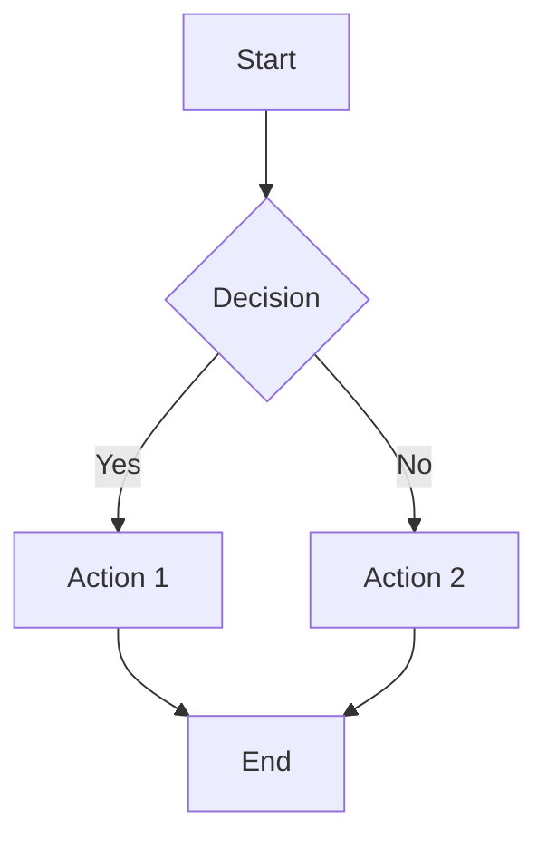
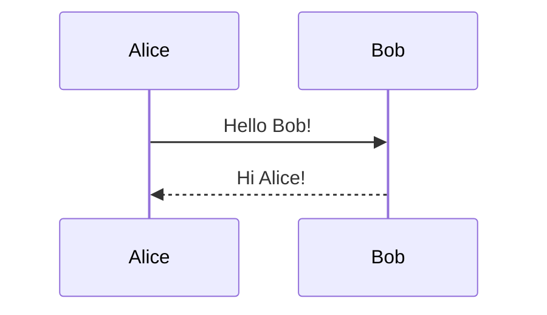
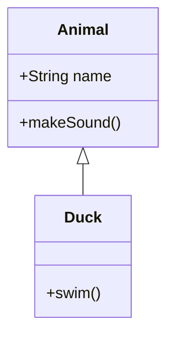

# 🎯 Guide d'Utilisation SmartReport

## Table des Matières

- [Démarrage Rapide](#démarrage-rapide)
- [Interface Utilisateur](#interface-utilisateur)
- [Génération de Diagrammes](#génération-de-diagrammes)
- [Génération de Comptes Rendus](#génération-de-comptes-rendus)
- [Gestion des Images](#gestion-des-images)
- [Configuration de l'Export](#configuration-de-lexport)
- [Export PDF/DOCX](#export-pdfdocx)
- [Gestion de Projets](#gestion-de-projets)
- [Fonctionnalités Avancées](#fonctionnalités-avancées)
- [Cas d'Usage Détaillés](#cas-dusage-détaillés)
- [Bonnes Pratiques](#bonnes-pratiques)
- [FAQ](#faq)

---

## Démarrage Rapide

### 1. Lancer l'Application

**Windows :**
```bash
start.bat
```

**Linux/macOS :**
```bash
python app.py
```

→ Ouvrir http://127.0.0.1:5173 dans le navigateur

### 2. Configuration Initiale (Première Utilisation)

1. Cliquer sur **⚙️ Paramètres** (coin supérieur droit)
2. Sélectionner le **Provider IA** : Mistral (recommandé)
3. Coller votre **Clé API**
4. Cliquer **Tester** pour vérifier la connexion
5. Cliquer **Sauvegarder**

**✅ Vous êtes prêt !**

---

## Interface Utilisateur

### Vue d'Ensemble

L'interface est divisée en **4 sections principales** :

```
┌─────────────────────────────────────────────────────────┐
│  En-tête : Logo Enovacom | Titre | Bouton Paramètres   │
├─────────────────────────────────────────────────────────┤
│                                                           │
│  1️⃣ GÉNÉRATION DE DIAGRAMME                             │
│     [Prompt] [Bouton Générer] [Thème] [Exporter]        │
│     [Prévisualisation Mermaid]                           │
│                                                           │
├─────────────────────────────────────────────────────────┤
│                                                           │
│  2️⃣ GÉNÉRATION DE COMPTE RENDU                          │
│     [Notes brutes] [Template] [Bouton Générer]          │
│     [Éditeur riche HTML]                                 │
│                                                           │
├─────────────────────────────────────────────────────────┤
│                                                           │
│  3️⃣ GESTION DES IMAGES                                  │
│     [Upload] [Liste des images avec titres]             │
│                                                           │
├─────────────────────────────────────────────────────────┤
│                                                           │
│  4️⃣ CONFIGURATION DE L'EXPORT PDF                       │
│     [Logo] [Titre] [Client] [Sous-titre]                │
│     [Boutons: Télécharger PDF | Télécharger Word]       │
│                                                           │
├─────────────────────────────────────────────────────────┤
│                                                           │
│  📂 HISTORIQUE DES PROJETS                               │
│     [Liste des projets sauvegardés]                      │
│                                                           │
└─────────────────────────────────────────────────────────┘
```

### Barre d'En-Tête

| Élément | Description |
|---------|-------------|
| **Logo Enovacom** | Identité visuelle |
| **Titre** | "Générateur de Rapports avec IA" |
| **⚙️ Paramètres** | Configuration des providers IA |
| **❓ Aide** | Documentation rapide (tooltip) |

---

## Génération de Diagrammes

### Étape 1 : Saisir le Prompt

Dans la zone **"Décrivez votre diagramme"**, entrer une description en français ou anglais :

**Exemples de prompts :**

#### Flowchart
```
Processus de validation de commande e-commerce :
1. Client ajoute produits au panier
2. Clic "Commander"
3. Vérification stock
4. Si stock OK → Paiement, sinon → Alerte rupture
5. Paiement validé → Confirmation email
6. Préparation commande → Expédition
```

#### Sequence Diagram
```
Authentification JWT avec refresh token :
- Client envoie login/password à l'API
- API vérifie credentials via AuthService
- AuthService génère access token (15min) et refresh token (7j)
- Client stocke les tokens
- Client appelle API protégée avec access token
- Quand access token expire, client utilise refresh token
```

#### Class Diagram
```
Système de gestion de bibliothèque :
- Classe Livre (titre, auteur, ISBN, année, disponible)
- Classe Auteur (nom, prénom, dateNaissance)
- Classe Emprunt (dateEmprunt, dateRetourPrévue, dateRetourRéelle)
- Classe Utilisateur (nom, email, numCarte)
- Relations : Un auteur écrit plusieurs livres, un utilisateur peut avoir plusieurs emprunts actifs
```

### Étape 2 : Choisir le Modèle IA (Optionnel)

- **Mistral Medium** (par défaut) : Équilibre qualité/vitesse
- **Mistral Large** : Meilleure qualité, plus lent
- **GPT-4 Turbo** : Très haute qualité (si OpenAI configuré)

### Étape 3 : Générer

Cliquer sur **🎨 Générer le Diagramme**

**Temps de génération :** 3-8 secondes

### Étape 4 : Prévisualisation et Édition

Le diagramme Mermaid apparaît instantanément.

**Options d'édition :**
- **Code Mermaid** : Éditer directement le code (mode expert)
- **Thème** : Choisir parmi 30+ thèmes professionnels
- **Couleurs personnalisées** :
  - Couleur primaire (bordures)
  - Couleur de remplissage
  - Couleur du texte
- **Police** : Poppins, Inter, Roboto, Arial, etc.
- **Taille** : 12px à 24px

### Étape 5 : Exporter

**Formats disponibles :**

| Format | Usage | Taille type |
|--------|-------|-------------|
| **SVG** | Documents imprimés, présentation PowerPoint | ~5-20 KB |
| **PNG** | Email, documentation web, Notion | ~50-200 KB |
| **JPEG** | Pièce jointe légère | ~30-100 KB |

**Cliquer sur le bouton correspondant → Téléchargement automatique**

---

## Génération de Comptes Rendus

### Étape 1 : Prendre des Notes Brutes

Dans la zone **"Notes de réunion"**, saisir des notes rapides (bullet points OK) :

**Exemple pour "Client Formel" :**
```
Réunion kick-off projet Interop V3
Date: 15/01/2026
Participants: Marie (Chef Projet Enovacom), Jean (Architecte), Dr. Dupont (DSI CHU Toulouse)

Contexte:
- Migration HL7 v2 vers FHIR R4
- Établissement : CHU Toulouse (1200 lits)
- Enjeu : interopérabilité avec DMP national

Points abordés:
- Budget: 150k€
- Deadline: juin 2026
- Contraintes: ressources internes limitées, formation équipe nécessaire
- Périmètre: 5 interfaces prioritaires (admissions, prescriptions, résultats labo, imagerie, comptes rendus)

Décisions:
- Go pour FHIR R4 (vs HL7 v3)
- Sprint 0 début février pour cadrage
- Formation équipe IT prévue mars

Actions:
- Marie: rédiger CDC détaillé - 22/01
- Jean: POC FHIR sur cas d'usage pilote (admissions) - 31/01
- DSI: valider ressources internes - 25/01

Prochaine réunion: 05/02/2026 - Présentation POC + validation CDC
```

**💡 Astuce :** Utiliser la **dictée vocale** (🎤) pour gagner du temps pendant la réunion

### Étape 2 : Choisir le Template

**21 templates disponibles** organisés en **7 catégories métier** :

---

## 📋 CATÉGORIE : GÉNÉRAL (4 templates)

#### 1. **Client Formel** (Réunions officielles)

**Structure générée :**
- Compte Rendu de Réunion (date, participants)
- Contexte & Objectif
- Points abordés
- Décisions prises
- Actions à mener (tableau avec responsables et échéances)
- Prochains rendez-vous

**Cas d'usage :**
- Kick-offs de projets
- Comités de pilotage
- Réunions d'avancement client
- Points de validation

#### 2. **Sprint Agile** (Cérémonies Scrum)

**Structure générée :**
- Sprint [N] - [Type de réunion]
- Objectifs du sprint
- User Stories traitées (tableau avec statuts)
- Blockers & Risques
- Décisions techniques
- Actions pour le prochain sprint
- Vélocité et métriques

**Cas d'usage :**
- Daily standups (synthèse hebdo)
- Sprint reviews
- Sprint retrospectives
- Sprint planning

#### 3. **Brief Technique** (Ateliers d'architecture)

**Structure générée :**
- Contexte technique
- Participants (avec rôles)
- Sujets abordés
- Décisions d'architecture (tableau avec justifications)
- Stack technique retenue
- Contraintes identifiées (perf, sécu, réglementaires)
- Actions techniques
- Points en suspens

**Cas d'usage :**
- Ateliers d'architecture
- Choix technologiques
- Design reviews
- Technical spikes

#### 4. **CRM Échange & Partage** (Visites commerciales)

**Structure générée :**
- Informations générales (client, date, type RDV)
- Contexte et objectifs
- Synthèse de l'échange
- **Opportunité(s) identifiée(s)** (budget, phase, probabilité, décideur, concurrence)
- Mise à jour base client (stack, version produits, contacts)
- Messages clés et réactions
- Actions de suivi
- Synthèse commerciale interne (montant total, priorité)
- Annexes

**Cas d'usage :**
- Visites clients
- Prospection
- Détection d'opportunités
- Suivi relationnel

#### 5. **Mail Client** (Email professionnel)

**Structure générée :**
- Objet du mail (clair et précis)
- Introduction contextualisée
- Corps du message structuré
- Points clés (liste à puces)
- Actions attendues (si applicable)
- Prochaines étapes
- Signature

**Types de mails supportés :**
- Confirmation de rendez-vous
- Compte rendu de réunion (version mail)
- Demande d'information / validation
- Relance action client
- Annonce livraison / mise en production
- Incident / problème technique
- Proposition commerciale
- Réponse à demande client

**Ton adapté selon contexte :**
- Formel (comités direction)
- Cordial (échanges projet)
- Urgent (incidents critiques)
- Informatif (points d'étape)

**Cas d'usage :**
- Communication client rapide
- Formalisation d'échanges téléphoniques
- Confirmation d'accords verbaux
- Relances d'actions
- Annonces de livraisons

#### 6. **CR Intervention Rapide** (Intervention courte)

**Structure générée :**
- En-tête (date, client, intervenant, durée, type)
- Objectif (1 phrase)
- Actions réalisées (liste numérotée)
- Résultat (statut + description)
- Tests (liste avec ✅/❌)
- Points d'attention (si nécessaire)
- Actions à suivre (client + Enovacom)
- Prochain RDV

**Format :** Synthétique (max 1 page)

**Différences vs CR Intervention complet :**
- ❌ Pas de détails techniques exhaustifs (versions, BDD, Java, OS)
- ❌ Pas de tableaux complexes
- ❌ Pas de section pré-requis détaillée
- ✅ Focus sur l'essentiel : quoi, résultat, actions

**Cas d'usage :**
- Interventions de support < 2h
- Configurations simples
- Hotfix urgents
- Assistance à distance
- Tests rapides
- Vérifications post-déploiement
- Interventions récurrentes

#### 7. **HPP - Audit** (Audit d'infrastructure HPP)

**Structure générée :**
- Compte Rendu d'Audit Technique HPP (date, client, auditeur)
- Contexte (objectif, périmètre audité, points d'attention)
- Audit des ressources du serveur (config matérielle, BDD, EAI/Application)
- Analyse (connecteurs/volumétrie, interfaces actives, scripts personnalisés, purges)
- Analyse système (prérequis montée de version, config matérielle, BDD, ports, sécurité)
- Préconisations / Plan d'action (tableau avec priorités Haute/Moyenne/Basse)
- Conclusion et annexes (fichier Excel interfaces, logs, captures)

**Cas d'usage :**
- Audits techniques de plateforme EAI/HPP
- Diagnostics pré-migration vers nouvelle version
- Analyse de configuration serveur/BDD
- Audits de performance et optimisation
- Validation prérequis techniques

#### 8. **HPP - Intervention** (Intervention opérationnelle HPP)

**Structure générée :**
- Compte Rendu d'Intervention Technique HPP (date, client, intervenants, type, durée)
- Récapitulatif de l'intervention (objectif, périmètre, statut final)
- Actions et vérifications (pré-requis validés, actions effectuées chronologiques)
- Informations techniques par application (accès IHM, config technique, BDD, Java, OS)
- Tests techniques effectués (fonctionnels, intégration, performance)
- Points bloquants / Incidents (tableau avec résolutions)
- Configuration finale (paramètres modifiés, fichiers livrés)
- Actions post-intervention (client et Enovacom)
- Recommandations et prochaines étapes

**Cas d'usage :**
- Interventions post-installation HPP
- Mise en production
- Recettes techniques
- Maintenance corrective / évolutive
- Hotfix en urgence

#### 9. **HPP - Installation** (Installation initiale HPP)

**Structure générée :**
- Compte Rendu d'Installation HPP (date, client, intervenants, produit, version, durée)
- Récapitulatif de l'installation (objectif, périmètre, statut final)
- Actions d'installation (pré-requis validés serveur/BDD/logiciels, étapes chronologiques)
- Informations techniques par application (accès IHM avec comptes admin, config technique, BDD, Java, OS)
- Tests techniques / fonctionnels avancés (tests de connectivité, tests fonctionnels de base)
- Spécificités de la plateforme (configuration spécifique client, points d'attention)
- Documentation livrée (fichiers fournis, emplacement)
- Actions post-installation (à réaliser par le client et Enovacom)
- Prochaines étapes (prochain RDV)

**Cas d'usage :**
- Installations initiales de produits HPP
- Migrations de plateforme EAI
- Mise à jour majeure de version
- Déploiement sur nouveau serveur

#### 10. **HPP - Fiche Écart** (Gestion des écarts projet HPP)

**Structure générée :**
- Fiche d'Écart HPP (dates ouverture/clôture, projet, client, responsables)
- Périmètre prévu avant cette fiche (périmètre défini dans quel doc, description initiale, livrables/délai/budget)
- Description de l'écart (écart exprimé par qui, description besoin/modification, nature écart, justification)
- Description de la solution (solution proposée, faisabilité, détails techniques, impact projet)
- Traitement de l'écart (décision prise, validation contractuelle, planning mis à jour, actions à mener)
- Suivi de réalisation (avancement, points bloquants, validation finale)
- Annexes (emails, specs, chiffrage)

**Cas d'usage :**
- Gestion des modifications de périmètre projet
- Documentation des demandes client hors périmètre
- Traçabilité contractuelle des écarts
- Gestion des avenants
- Suivi budgétaire et planning

#### 11. **Correction Orthographe** (Relecture)

**Structure générée :**
- Conservation totale de la structure existante
- Correction uniquement orthographe, grammaire, ponctuation
- Pas de modification du fond

**Cas d'usage :**
- Relecture de CR avant envoi
- Correction de transcriptions vocales
- Nettoyage de documents avant publication

### Étape 3 : Ajouter du Contexte (Optionnel)

**Champs additionnels :**
- **Date de réunion** : JJ/MM/AAAA (utilisé dans les échéances)
- **Participants** : Liste avec rôles (affichée en en-tête)

### Étape 4 : Générer

Cliquer sur **✨ Générer le Compte Rendu**

**Temps de génération :** 5-15 secondes (selon longueur des notes)

### Étape 5 : Éditer (Si Besoin)

Le compte rendu généré apparaît dans un **éditeur riche** (contentEditable).

**Fonctionnalités d'édition :**

| Fonction | Raccourci | Bouton |
|----------|-----------|--------|
| Gras | Ctrl/Cmd + B | **B** |
| Italique | Ctrl/Cmd + I | *I* |
| Soulign\u00e9 | Ctrl/Cmd + U | <u>U</u> |
| Titre 1 | Ctrl/Cmd + 1 | H1 |
| Titre 2 | Ctrl/Cmd + 2 | H2 |
| Liste à puces | Ctrl/Cmd + Shift + 8 | • |
| Liste numérotée | Ctrl/Cmd + Shift + 7 | 1. |
| Lien | Ctrl/Cmd + K | 🔗 |
| Code | - | `</>` |
| **Insérer tableau** | - | 📊 |

**Édition de tableaux :**
1. Cliquer **Insérer tableau** → Tableau 3x3 par défaut
2. Ajouter des lignes/colonnes via menu contextuel (clic droit)
3. Fusionner/diviser cellules
4. Modifier contenu directement

### Étape 6 : Sauvegarde Automatique

✅ Le projet est **automatiquement sauvegardé** dans le `localStorage` du navigateur.

---

## Gestion des Images

### Ajouter des Images

**Méthode 1 : Drag & Drop**
1. Glisser-déposer des images depuis l'explorateur de fichiers
2. Formats acceptés : PNG, JPG, JPEG, GIF, BMP, WEBP, SVG

**Méthode 2 : Upload**
1. Cliquer **Ajouter des images**
2. Sélectionner un ou plusieurs fichiers

**Limite :** ~5 MB par image (base64 data URL)

### Titres Descriptifs

Pour chaque image, ajouter un **titre descriptif** :

**Exemples :**
- "Architecture cible de la solution"
- "Mockup de l'écran de connexion"
- "Diagramme de flux de données"
- "Capture d'écran de l'interface admin"

**💡 Important :** Le titre sera affiché en **gras** au-dessus de l'image dans le PDF

### Réorganiser

Utiliser les boutons **↑** et **↓** pour changer l'ordre d'apparition dans le PDF.

### Supprimer

Cliquer sur **🗑️** pour retirer une image.

---

## Configuration de l'Export

### Logo

**Option 1 : Logo Enovacom (par défaut)**
- Logo pré-chargé automatiquement

**Option 2 : Logo personnalisé**
1. Glisser-déposer votre logo
2. Formats : PNG (transparent recommandé), JPG, SVG
3. Taille optimale : 800x200 px (ratio ~4:1)

### Informations du Document

| Champ | Description | Exemple |
|-------|-------------|---------|
| **Titre** | Titre principal du document | "Compte Rendu - Kick-off Projet Interop V3" |
| **Client** | Nom de l'établissement/entreprise | "CHU de Toulouse" |
| **Sous-titre** | Précision additionnelle | "Phase de cadrage - Sprint 0" |

### Pied de Page

**Template par défaut :**
```
{page}/{pages} • {projet} • {date}
```

**Variables disponibles :**
- `{page}` : Numéro de page actuelle
- `{pages}` : Nombre total de pages
- `{projet}` : Titre du document
- `{date}` : Date actuelle (JJ/MM/AAAA)

**Exemples personnalisés :**
```
Page {page}/{pages} - {projet} - Confidentiel
{projet} | {date} | Page {page}
ENOVACOM - {projet} - {date}
```

### Mentions Légales

**Texte affiché en bas à gauche de chaque page.**

**Par défaut :**
```
ENOVACOM - Tous droits réservés
```

**Exemples :**
```
ENOVACOM - Document confidentiel - Tous droits réservés
© 2026 ENOVACOM - Usage interne uniquement
ENOVACOM SAS - SIRET 123 456 789 00010
```

### Options Avancées

#### Watermark "CONFIDENTIEL"

☑️ Cocher pour afficher un filigrane diagonal sur chaque page.

**Apparence :**
- Texte : "CONFIDENTIEL"
- Couleur : Gris clair (semi-transparent)
- Rotation : 45°
- Position : Centre de la page

#### Ordre des Blocs

Choisir l'ordre d'apparition dans le PDF :

**Option 1 : Compte rendu → Images → Diagramme** (par défaut)
- Idéal pour copier-coller le CR en début de document

**Option 2 : Diagramme → Compte rendu → Images**
- Idéal pour commencer par une vue d'ensemble visuelle

**Option 3 : Images → Compte rendu → Diagramme**
- Idéal pour illustrations en contexte

#### Thème Visuel

**Couleur primaire** : Utilisée pour les en-têtes de tableaux et titres

**Exemples :**
- `#0C4A45` (Vert Enovacom - par défaut)
- `#1E3A8A` (Bleu marine professionnel)
- `#7C3AED` (Violet moderne)

**Police** : Inter, Poppins, Roboto, Arial, Helvetica

**Marges** : Ajustables en mm (haut, droite, bas, gauche)

---

## Export PDF/DOCX

### Génération PDF

1. Cliquer **📄 Télécharger PDF**
2. **Temps de génération :** 2-5 secondes (selon taille)
3. Téléchargement automatique : `Document_AAAA-MM-JJ.pdf`
4. Une entrée est ajoutée à l'historique avec horodatage

**Caractéristiques du PDF :**
- ✅ Tableaux stylés avec en-tête coloré
- ✅ Images redimensionnées automatiquement (largeur max : 170mm)
- ✅ Sauts de page intelligents (KeepTogether pour titres+contenu)
- ✅ Numérotation automatique des pages
- ✅ Pieds de page personnalisés
- ✅ Support des listes à puces et numérotées
- ✅ Support du texte riche (gras, italique, souligné)
- ✅ Liens hypertexte cliquables

### Génération DOCX

1. Cliquer **📄 Télécharger Word**
2. **Temps de génération :** 2-5 secondes
3. Téléchargement automatique : `Document_AAAA-MM-JJ.docx`
4. Entrée ajoutée à l'historique

**Caractéristiques du DOCX :**
- ✅ Mise en page identique au PDF
- ✅ 100% éditable dans Microsoft Word
- ✅ Tableaux avec styles (bordures, couleurs)
- ✅ Images insérées avec légendes
- ✅ Texte riche conservé
- ✅ Compatible LibreOffice, Google Docs

**💡 Astuce :** Utiliser DOCX pour partager sur Google Drive ou pour modifications ultérieures

---

## Gestion de Projets

### Sauvegarde Automatique

✅ **Chaque modification est automatiquement sauvegardée** dans le `localStorage` du navigateur.

**Modifications détectées :**
- Changement de diagramme
- Édition du compte rendu
- Ajout/suppression d'images
- Modification de la configuration PDF

**Intervalle :** En temps réel (Alpine.js reactive)

### Historique des Projets

**Affichage :** Liste des 20 derniers projets

**Informations affichées :**
- Nom du projet (auto-généré ou personnalisé)
- Date de création
- Date de dernière modification

### Ouvrir un Projet

1. Cliquer **Ouvrir** sur un projet de la liste
2. Toutes les données sont rechargées :
   - Diagramme Mermaid
   - Compte rendu HTML
   - Images avec titres
   - Configuration PDF

### Renommer un Projet

1. Cliquer sur le nom du projet
2. Saisir le nouveau nom
3. Valider (Entrée) ou annuler (Échap)

### Supprimer un Projet

1. Cliquer **Supprimer** (🗑️)
2. **Confirmation requise** (pas de retour en arrière)

### Effacer Tout l'Historique

1. Cliquer **Tout effacer** (en bas de la liste)
2. **Confirmation requise**
3. Tous les projets sont définitivement supprimés

⚠️ **Attention :** Les données sont stockées localement dans le navigateur. Si vous effacez les données de navigation (cache, cookies, localStorage), vos projets seront perdus.

### Export/Import de Projets

**Export (sauvegarde externe) :**
1. Ouvrir DevTools (F12)
2. Console :
   ```javascript
   const projects = JSON.parse(localStorage.getItem('smartreport_projects') || '[]');
   const blob = new Blob([JSON.stringify(projects, null, 2)], {type: 'application/json'});
   const url = URL.createObjectURL(blob);
   const a = document.createElement('a');
   a.href = url;
   a.download = 'smartreport_backup.json';
   a.click();
   ```

**Import (restauration) :**
1. DevTools → Console :
   ```javascript
   // Coller le contenu JSON exporté
   const projects = [/* ... */];
   localStorage.setItem('smartreport_projects', JSON.stringify(projects));
   location.reload();
   ```

---

## Fonctionnalités Avancées

### Dictée Vocale

**Activation :**
1. Cliquer sur **🎤** (dans zone "Prompt" ou "Notes")
2. Autoriser l'accès au microphone (première fois)
3. Parler en français
4. Transcription en temps réel
5. Cliquer **⏹️** pour arrêter

**Prérequis :**
- Navigateur Chrome ou Edge
- Connexion Internet (Web Speech API cloud)
- Autorisation microphone

**Langues supportées :**
- Français (fr-FR) par défaut
- Anglais (en-US, en-GB)
- Espagnol (es-ES)

**Limitations :**
- Ponctuation automatique approximative
- Nécessite un débit vocal clair
- Timeout après 60s d'inactivité

### Personnalisation des Thèmes Mermaid

**Thèmes pré-définis (30+) :**

#### Professionnels
- Enovacom (vert #0C4A45)
- Graphite (gris foncé)
- Ardoise (bleu-gris)
- Océan (bleu turquoise)

#### Sombres
- Dark Mode
- Midnight
- Charbon
- Noir Étoilé

#### Colorés
- Arc-en-ciel
- Tropical
- Sunset
- Aurora

#### Pastel
- Douceur
- Lavande
- Menthe
- Pêche

**Personnalisation avancée :**
1. Choisir un thème de base
2. Ajuster les couleurs :
   - **Primaire** : Bordures des boîtes
   - **Remplissage** : Fond des boîtes
   - **Texte** : Couleur du texte
3. Modifier la police et la taille
4. Prévisualisation en temps réel

### Édition Directe du Code Mermaid

**Activer le mode expert :**
1. Cliquer **Éditer le code** (sous le diagramme)
2. Modifier le code Mermaid directement
3. Le rendu se met à jour automatiquement

**Syntaxe Mermaid :**

**Flowchart :**


**Sequence :**


**Class :**


**📖 Documentation Mermaid :** https://mermaid.js.org/

---

## Cas d'Usage Détaillés

### 1. Réunion Client - Kick-off de Projet

**Contexte :**
- Réunion de lancement d'un projet d'interopérabilité
- Durée : 2h
- Participants : Chef de projet (vous), Architecte, DSI client

**Workflow :**

#### Pendant la Réunion (15 min)
1. Activer **dictée vocale** (🎤) dans "Notes de réunion"
2. Parler naturellement pendant la réunion
3. Ou prendre des notes rapides en bullet points :
   ```
   Kick-off Interop V3
   15/01/2026
   Marie CP, Jean Archi, Dr Dupont DSI
   
   Budget 150k€
   Deadline juin 2026
   Migration HL7v2 → FHIR R4
   
   Décisions:
   - Go FHIR R4
   - Sprint 0 février
   
   Actions:
   - Marie: CDC 22/01
   - Jean: POC 31/01
   ```

#### Après la Réunion (5 min)
4. Choisir template **"Client formel"**
5. Cliquer **Générer le CR** → Compte rendu structuré généré
6. Éditer si besoin (ajuster dates, préciser points)
7. **Générer diagramme** (optionnel) :
   ```
   Architecture cible avec API Gateway FHIR, serveur FHIR, 5 interfaces prioritaires
   ```
8. Uploader **logo Enovacom** (ou logo client)
9. Configurer export :
   - Titre : "Compte Rendu - Kick-off Projet Interop V3"
   - Client : "CHU de Toulouse"
   - Sous-titre : "Phase de cadrage"
10. Cliquer **Télécharger PDF**

**Résultat :**
- Document professionnel de 3-4 pages
- Prêt à envoyer au client
- **Temps total : ~20 minutes** (vs 1h de rédaction manuelle)

---

### 2. Sprint Review - Fin de Sprint Agile

**Contexte :**
- Sprint 5 d'un projet agile (2 semaines)
- Équipe : 5 devs + PO + Scrum Master

**Workflow :**

#### Pendant la Review (10 min)
1. Noter les points clés :
   ```
   Sprint 5 Review - 24/01/2026
   Objectif: API CRUD patients + interface admin
   
   US terminées:
   - US-23: API REST (13 pts) ✅
   - US-24: Interface admin (8 pts) ✅
   - US-26: Tests e2e (5 pts) ✅
   Total: 26 pts (vélocité: 26)
   
   Blockers:
   - Perfs dégradées requêtes +10k patients
   - Jean investigue
   
   Décisions:
   - Redis pour cache
   - Refacto API sprint 6
   
   Actions:
   - Jean: POC Redis 31/01
   - Marie: Planif sprint 6 26/01
   ```

#### Après la Review (2 min)
2. Template **"Sprint Agile"**
3. Générer → Tableaux automatiquement formatés
4. Ajouter **capture d'écran** de l'interface admin
5. Télécharger **DOCX** (pour partage Google Drive équipe)

**Résultat :**
- CR structuré avec métriques
- Blockers identifiés clairement
- Actions trackées avec dates
- **Temps gagné : ~40 min**

---

### 3. Atelier Technique - Choix d'Architecture

**Contexte :**
- Atelier de 3h pour choisir architecture API Gateway
- 3 architectes + 2 tech leads

**Workflow :**

#### Pendant l'Atelier (20 min)
1. Notes techniques :
   ```
   Atelier API Gateway - 16/01/2026
   Participants: Jean (Lead Archi), Marie (Archi Cloud), Tom (Tech Lead)
   
   Contexte:
   - Microservices 15+
   - Charge: 1000 req/sec
   - Latence max: 200ms
   - HA requis (99.9%)
   
   Options étudiées:
   1. Kong (OSS)
      + Performant, plugins riches
      - Complexe à maintenir, courbe apprentissage
   
   2. AWS API Gateway
      + Managé, scalable
      - Vendor lock-in, coût élevé
   
   3. Traefik ⭐
      + Natif k8s, config dynamique, communauté active
      + Perfs excellentes (benchmarks)
      - Doc parfois lacunaire
   
   Décision: Traefik + Redis
   Justif: cloud-native, intégration k8s native, coût maîtrisé
   
   Stack:
   - Traefik 3.0 (reverse proxy + load balancer)
   - Redis 7.2 (cache + rate limiting)
   - Prometheus + Grafana (monitoring)
   
   Actions:
   - Jean: POC Traefik 25/01
   - Marie: Setup Redis cluster 30/01
   - Tom: Définir métriques 22/01
   ```

2. **Générer diagramme** :
   ```
   Architecture API Gateway avec Traefik :
   - Clients (web, mobile) → Traefik (load balancer)
   - Traefik → 15 microservices (gRPC/REST)
   - Traefik → Redis (cache, rate limiting)
   - Traefik → Prometheus (métriques)
   - Tout dans Kubernetes cluster
   ```

#### Après l'Atelier (5 min)
3. Template **"Brief technique"**
4. Générer CR
5. Personnaliser thème du diagramme (couleurs entreprise)
6. Exporter diagramme en **SVG** → Ajouter aux images
7. Télécharger **PDF**

**Résultat :**
- Document technique de référence
- Diagramme d'architecture vectoriel
- Justifications des choix
- **Temps gagné : ~1h** (vs rédaction + Visio)

---

### 4. Visite Commerciale - Détection d'Opportunités

**Contexte :**
- Visite chez client potentiel (CH de Perpignan)
- Objectif : identifier opportunités de vente

**Workflow :**

#### Pendant la Visite (5 min, discret)
1. **Dictée vocale** (téléphone ou laptop discret) :
   ```
   CH Perpignan, 17/01/2026
   Contact Dr Martin DSI
   
   Besoins exprimés:
   - Moderniser DPI actuel Cerner legacy
   - Projet EPP échange inter-établissements
   - Budget DSI annuel 2M€
   
   Opportunités:
   - Migration DPI cloud 300k€
   - Hub interop régional 150k€
   
   Concurrence: McKesson, InterSystems
   Niveau ouverture: Fort, mécontent actuel
   ```

#### Après la Visite (10 min, dans la voiture ou bureau)
2. Template **"CRM Échange & Partage"**
3. Générer → Structure complète avec opportunités chiffrées
4. Vérifier les montants, probabilités
5. Télécharger **PDF**
6. **Copier-coller** le CR dans Salesforce/CRM

**Résultat :**
- CR commercial structuré
- Opportunités identifiées et chiffrées
- Actions de suivi planifiées
- **Temps gagné : ~50 min** (vs saisie CRM manuelle)

---

## Bonnes Pratiques

### Génération de Diagrammes

✅ **Décrire clairement les relations**
```
Client envoie requête → API valide → Si OK génère token, sinon erreur
```

✅ **Utiliser des verbes d'action**
```
Utilisateur clique "Commander" → Système vérifie stock → Si disponible crée commande
```

✅ **Préciser les types de diagrammes complexes**
```
Diagramme de séquence avec boucle pour authentification avec retry (3 tentatives max)
```

❌ **Éviter les descriptions vagues**
```
Système de gestion  // Trop vague
```

### Génération de Comptes Rendus

✅ **Structurer les notes avec sections claires**
```
Contexte:
...

Points abordés:
...

Décisions:
...

Actions:
...
```

✅ **Inclure dates et responsables**
```
Actions:
- Marie: rédiger CDC - 22/01
- Jean: POC FHIR - 31/01
```

✅ **Préciser les montants, délais, métriques**
```
Budget: 150k€
Deadline: juin 2026
Vélocité: 26 points
```

❌ **Éviter les notes trop synthétiques**
```
Réunion OK, actions définies  // Pas assez de détails
```

### Export PDF/DOCX

✅ **Titres descriptifs pour images**
```
Architecture cible de la solution FHIR
Mockup de l'écran de connexion v2.1
Diagramme de flux de validation de commande
```

✅ **Ordre logique des blocs**
- Compte rendu → Images → Diagramme (pour CR à copier-coller)
- Diagramme → Compte rendu → Images (pour présentation visuelle)

✅ **Watermark uniquement si confidentiel**
- Cocher pour documents sensibles
- Laisser décoché pour documents publics

❌ **Éviter les titres génériques**
```
Image 1  // Pas assez descriptif
Capture écran  // Trop vague
```

---

## FAQ

### Q1 : Puis-je utiliser SmartReport sans connexion Internet ?

**R :** Partiellement.

✅ **Fonctionne offline :**
- Interface utilisateur
- Édition de comptes rendus
- Gestion de projets (localStorage)
- Avec **Ollama** en local : génération IA 100% offline

❌ **Nécessite Internet :**
- Génération IA (Mistral, OpenAI, etc.)
- Dictée vocale (Web Speech API)

### Q2 : Mes projets sont-ils sauvegardés sur un serveur ?

**R :** **Non.** Tout est stocké dans le `localStorage` de votre navigateur (côté client).

**Avantages :**
- ✅ Aucune donnée envoyée à un serveur Enovacom
- ✅ Confidentialité totale
- ✅ Pas de limite de stockage serveur

**Inconvénients :**
- ⚠️ Si vous effacez les données de navigation, projets perdus
- ⚠️ Pas de synchronisation entre navigateurs/machines

**Solution :** Exporter régulièrement vos projets (voir [Export/Import](#exportimport-de-projets))

### Q3 : Combien de temps prend la génération d'un diagramme ?

**R :** **3-8 secondes** en moyenne (provider cloud).

**Facteurs :**
- Provider (Mistral = rapide, OpenAI = plus lent)
- Complexité du diagramme
- Charge du provider
- Connexion Internet

**Ollama local :** 10-30 secondes (selon GPU)

### Q4 : Puis-je éditer le code Mermaid généré ?

**R :** **Oui.** Cliquer **Éditer le code** sous le diagramme.

**Syntaxe Mermaid :** https://mermaid.js.org/

### Q5 : Quelle est la limite de taille des images ?

**R :** **~5 MB par image** (limite pratique des data URLs base64).

**Recommandations :**
- Utiliser PNG compressé ou JPEG qualité 80%
- Redimensionner avant upload (largeur max : 1920px)
- Privilégier PNG transparent pour logos/diagrammes

### Q6 : Les tableaux générés dans les comptes rendus sont-ils éditables ?

**R :** **Oui.** Utiliser l'éditeur riche :
- Clic droit sur tableau → Insérer ligne/colonne
- Double-clic sur cellule → Éditer contenu
- Sélectionner cellules → Fusionner

### Q7 : Puis-je exporter uniquement le diagramme (sans CR) ?

**R :** **Oui.** Utiliser les boutons **Exporter SVG/PNG/JPEG** directement sous le diagramme.

### Q8 : Comment changer le provider IA ?

**R :**
1. Cliquer **⚙️ Paramètres**
2. Sélectionner nouveau provider (Mistral, OpenAI, Ollama, etc.)
3. Saisir clé API
4. Tester → Sauvegarder

### Q9 : Puis-je utiliser plusieurs providers en même temps ?

**R :** **Non** (actuellement). Un seul provider actif à la fois.

**Workaround :** Basculer manuellement via Paramètres.

### Q10 : Le watermark "CONFIDENTIEL" est-il supprimable après export ?

**R :** **Non**, il est intégré dans le PDF. Décocher l'option avant génération.

---

**📖 Documentation complète** : [Retour au README principal](../README.md)
